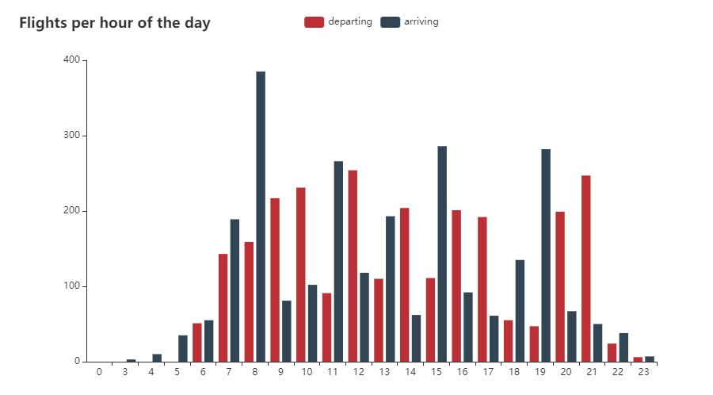

# SchipholFlightAnalyser
The goal of this tool is to analyse the flights of Schiphol using their [Public Flight API](https://developer.schiphol.nl/).

## Getting started
You can register for free to obtain an API key and add this in the `config.yml` (see sample file). You also need to edit the
path to your `config.yml` in the `config.go`, as it is currently using an absolute url instead of a relative one.

## Flight distribution
One research question which could be answered using this tool is the following one: are the flights coming and going from Schiphol
 distributed evenly over the 24 hours of a natural day? Anwer, no:
 
 
 